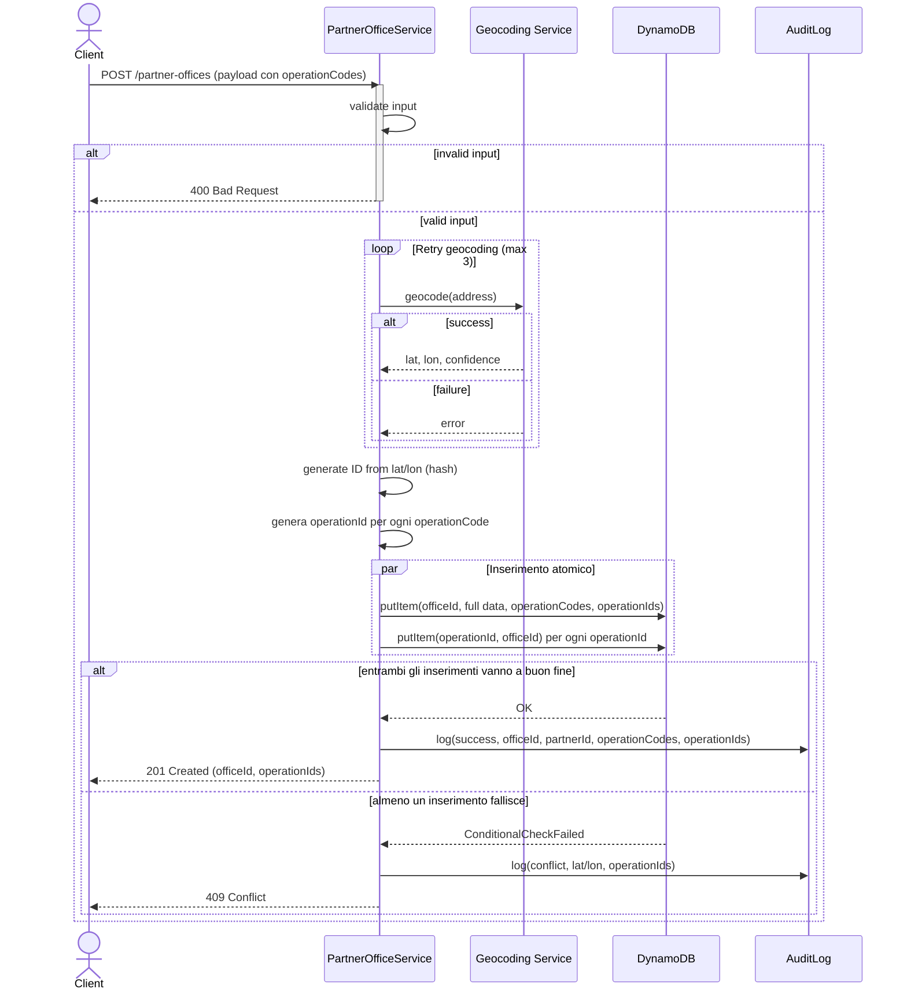

# Creazione di un Punto di Ritiro 
In questo scenario, vogliamo creare un punto di ritiro 

Ogni punto di ritiro avrà una proprietà aggiuntiva `operationCodes`, che rappresenta una lista di codici che il partner può utilizzare per identificare le operazioni compiute presso quello specifico punto di ritiro. Per ogni `operationCode` fornito in input, il sistema genera un corrispondente `operationId` che verrà restituito nella risposta e potrà essere utilizzato nelle operazioni future.

## API Utilizzate
- createPartnerOffice
- GET /partners/{partnerId}/partner-offices/operation-ids/{operationId}

## Sequence Diagram 

